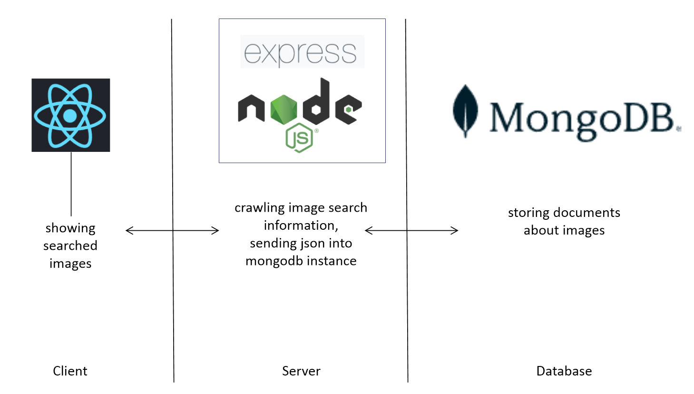

# Image getter

간단한 Node.js&React&MongoDB 프로젝트입니다.

네이버 API를 활용해 이미지를 최신순으로 검색할 수 있고 특정 사진을 자신의 보관함에 담아둘 수 있도록 한 웹페이지입니다

현재 코드에서 API connection 정보를 지워둔 상태입니다.

root directory에서 
```
$ npm start
```
backend directory에서
```
$ nodemon server
```

# 구조도


# 구현 캡쳐
<div>

</div>
<hr>
<div>

</div>
